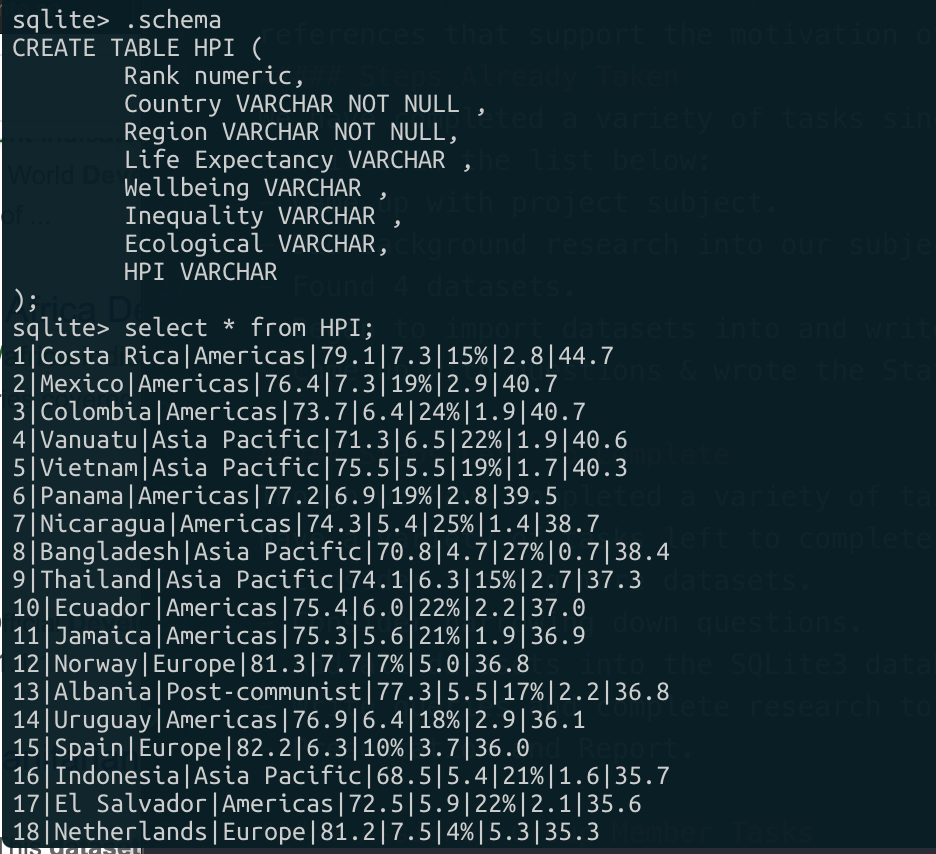

#### Date: 15 April 2019
#### Name(s): Christian Lussier, Robert Samuel, Jordan Wilson

#### Progress Report

##### Project Subject
Our project subject is to use database systems to research African Development and Economics. We intend to look into a number of questions about Africa, it's development, and its current situations. More specifically, we will look for things in our data that may be negatively affecting the development and economics of African countries.

Despite gaining independence in the mid-1900s and receiving financial aid, loans, and more, African countries have faced great problems in their development and in developing their economies to compete on a world scale. With this, this project has some real-world relevance because economists and development experts are trying to solve this development problem every day.

We feel that trying to answer the questions below could provide some valuable insights into what is stopping African economic development. Additionally, these questions could find correlations between different ideas to see if they have any impact on another.

##### Main Questions to Address
1) Africa's Real GDP Growth rate seemed to steadily increase for a few decades, but then it took a downturn. When did this downturn occur and why?

2) Do countries with higher GDP growth/GDP per capita have higher Happy Planet Indexes (representing citizen happiness)?

3) Is there a correlation between living standards and GDP per capita?

4) Are countries that live in a specific region overall happier than countries that don't live in that region? (i.e. Sub-Saharan Africa and MENA)

5) Do countries with a higher natural resources rent (as a % of GDP) have a higher GDP per capita or vice versa? Do the findings from this question make steps to validate the idea of the resource curse?

##### Data Citations and References
In order to research our subject and answer our questions, we had to find data from a number of sources and articles:
- [Happy Planet Index](http://happyplanetindex.org): Contains information about how happy citizens are living in their respective countries. Also provides valuable insights into life expectancy, wellness, and more in Africa.
- [World Bank](https://databank.worldbank.org/data/source/africa-development-indicators#): This type of information contains the GDP (Gross Domestic Products) and GDP per Capita (in current $USD) of all of the African countries between 2000 and 2012. This gives us an insight into the type of healthcare these African countries have and their standards of living.
- [IMF - Real GDP Growth in Africa](https://www.imf.org/external/datamapper/NGDP_RPCH@WEO/OEMDC/ADVEC/WEOWORLD): Contains information about Africa's real GDP growth over the last few decades.
- [Natural Resource Rents (% of GDP)](https://data.worldbank.org/indicator/ny.gdp.totl.rt.zs): Contains data from the last several decades about what percentage of a country's GDP are from natural resources.

Additionally, we completed research outside the data about Africa and found references that support the motivation of our project. For instance, in their article ["Why Has Africa Grown Slowly"](https://www.aeaweb.org/articles?id=10.1257/jep.13.3.3), Collier, Paul, and Gunning discuss Africa's slow growth over since the late twentieth century and discuss some of the issues African economies have faced, such as a heavy reliance of natural resources. This further validates our argument of the relevance of issues surrounding African development. Additionally, another [reference from the Wiley Online Library](https://onlinelibrary.wiley.com/doi/epdf/10.1111/roiw.12013) talks about the contemporary statistical foundations of the recent growth in per‐capita GDP and reduction in poverty, which were found to be quite weak in reality.

###### Reference Citations:
- Collier, Paul, and Jan Willem Gunning. 1999. "Why Has Africa Grown Slowly?" Journal of Economic Perspectives, 13 (3): 3-22.
- Devarajan, S. (2013), Africa's Statistical Tragedy. Review of Income and Wealth, 59: S9-S15. doi:10.1111/roiw.12013

##### Steps Already Taken
We have completed a variety of tasks since beginning this project. They are detailed in the list below:
- Came up with project subject.
- Did background research into our subject.
- Found 4 datasets.
- Began to import datasets into and write code for our SQLite3 database. Here is part of one of the imported datasets inside SQLite3:

- Came up with questions & wrote the Status Update.

##### Steps Left to Complete
Though we have completed a variety of tasks since beginning this project, we still have a variety of tasks left to complete. They are detailed in the list below:
- Consider finding more datasets.
- Consider narrowing down questions.
- Add all datasets into the SQLite3 database.
- Write queries and complete research to answer questions.
- Presentation and Report.

##### Assigned Group Member Tasks
In order to ensure that work is spread out properly between group members, we have assigned each group member tasks. Despite this, we will still try to work as a team, with each group member taking the lead on their assigned task and others supporting as necessary.

###### Christian
- Add all datasets into the SQLite3 database so queries can be written.
- Write queries.
- Presentation and Report.

###### Robert
- Refine questions and complete background research.
- Write queries and complete research to answer questions.
- Presentation and Report.

###### Jordan
- Find more datasets as necessary.
- Write queries and complete research to answer questions.
- Presentation and Report.
